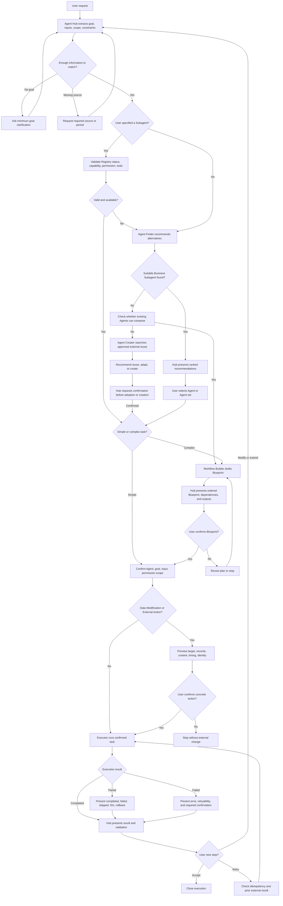

# Agent Hub 端到端流程图

来源：项目 README 的 End-to-End Agent Hub Flow。

```mermaid
flowchart TD
  U[User request] --> H[Agent Hub extracts goal, inputs, scope, constraints]
  H --> C{Enough information to match?}
  C -- No goal --> Q1[Ask minimum goal clarification]
  Q1 --> H
  C -- Missing source --> Q2[Request required source or period]
  Q2 --> H
  C -- Yes --> S{User specified a Subagent?}

  S -- Yes --> V[Validate Registry status, capability, permission, tools]
  V --> VP{Valid and available?}
  VP -- No --> F[Agent Finder recommends alternatives]
  VP -- Yes --> T{Simple or complex task?}
  S -- No --> F
  F --> FM{Suitable Business Subagent found?}
  FM -- No --> G1[Check whether existing Agents can compose]
  G1 -->|Yes| B[Workflow Builder drafts Blueprint]
  G1 -->|No| G2[Agent Creator searches approved external reuse]
  G2 --> G3[Recommend reuse, adapt, or create]
  G3 --> HC[Hub requests confirmation before adoption or creation]
  HC -->|Confirmed| T

  FM -- Yes --> R[Hub presents ranked recommendations]
  R --> UC[User selects Agent or Agent set]
  UC --> T

  T -- Simple --> CS[Confirm Agent, goal, input, permission scope]
  T -- Complex --> B
  B --> WB[Hub presents ordered Blueprint, dependencies, and outputs]
  WB --> WC{User confirms Blueprint?}
  WC -- No --> RQ[Revise plan or stop]
  RQ --> B
  WC -- Yes --> CS

  CS --> AC{Data Modification or External Action?}
  AC -- No --> E[Executor runs confirmed task]
  AC -- Yes --> PRE[Preview target, records, content, timing, identity]
  PRE --> CONF{User confirms concrete action?}
  CONF -- No --> STOP[Stop without external change]
  CONF -- Yes --> E

  E --> ER{Execution result}
  ER -- Completed --> OUT[Hub presents result and validation]
  ER -- Partial --> PART[Present completed, failed, skipped, IDs, rollback]
  ER -- Failed --> FAIL[Present error, retryability, and required confirmation]
  PART --> OUT
  FAIL --> OUT
  OUT --> REV{User next step?}
  REV -- Accept --> END[Close execution]
  REV -- Retry --> ID[Check idempotency and prior external result]
  ID --> E
  REV -- Modify or extend --> H
```
